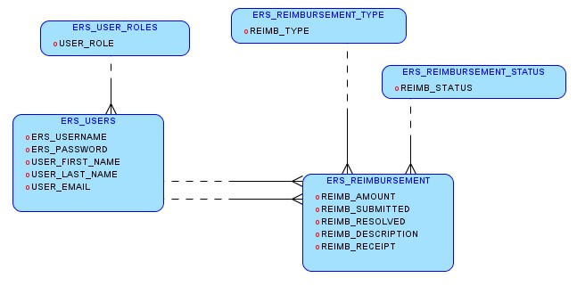

# Employee Reimbursment System (ERS)

## Executive Summary
The Expense Reimbursement System (ERS) will manage the process of reimbursing employees for expenses incurred while on company time. All employees in the company can login and submit requests for reimbursement and view their past tickets and pending requests. Finance managers can log in and view all reimbursement requests and past history for all employees in the company. Finance managers are authorized to approve and deny requests for expense reimbursement.

**State-chart Diagram (Reimbursement Statuses)** 

**Reimbursement Types**

Employees must select the type of reimbursement as: LODGING, TRAVEL, FOOD, or OTHER.

**Logical Model**

**Physical Model**

**Use Case Diagram**

**Activity Diagram**

## Technical Requirements

The back-end system shall use JDBC to connect to a Postgres database. The application shall deploy onto a Tomcat Server. The middle tier shall use Servlet technology for dynamic Web application development. The front-end view shall use HTML/CSS/JavaScript to make an application that can call server-side components in a generally RESTful manner. Passwords shall be encrypted in Java and securely stored in the database. The middle tier shall follow proper layered architecture, have reasonable (~70%) test coverage of the service layer, and implement log4j for appropriate logging. Webpages shall be styled to be functional and readable. 

## Technologies Used
* Java SE Development Kit 8
* Git
* Spring Tool Suite 4 - version 4.8.1 
* Apache Maven - version 3.6.3
* Apache Tomcat 9
* DBeaver - version 7.3.0
* Visual Studio Code
* Postman

## Features
* User/Employee can login
* After loggin in, user can make a new reimbursement request
* Regular employees can view all of their pending requests, as well as all of their previous requests
* Managers can view all pending requests, as well as all requests for the company
* User's name and role in the company is displayed in the single page application (SPA)
* User can log out, which invalidates the session

**To-do List:**
* Add feature for manager to approve or deny requests that are not their own
* Improve the functionality of the front end
* Make the client view more appealing
